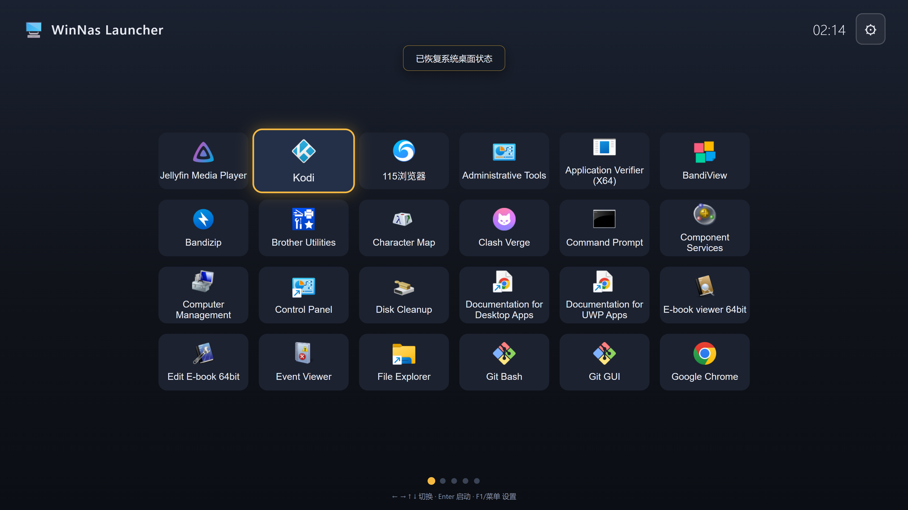

# WinNas Launcher

> 为 Windows x86 迷你主机 + 投影/电视场景设计的 **TV 启动器**，把 Windows 变成类似 Android TV 的媒体中心桌面。

开机直达全屏应用网格，用遥控器/键盘方向键操作，启动你的 Kodi、Jellyfin、播放器、游戏等，无需键鼠。

**语言：** [中文](README.md) | [English](README.en.md)

## ✨ 特性

- 🖥️ **无边框独占全屏** — 开机即全屏置顶，直达 Launcher，不看到 Windows 桌面
- 🎮 **纯遥控器/键盘操作** — 方向键焦点导航、网格分页、应用按使用频率自动排序
- 🚀 **一键启动任意程序** — 支持 `.exe` / `.lnk`，启动后程序自动置顶、退出后自动回 Launcher
- 📺 **网格菜单 + 分页** — 6×4 网格，翻页浏览，自动提取应用图标
- 🗂️ **应用管理** — 删除、移到最前/最后（固定排序），持久化保存
- 🔒 **拦截系统快捷键** — 防止误触 Win / Win+D / Alt+F4 等切出 Launcher
- 🔊 **音量控制 + OSD** — 遥控音量键调节系统音量，屏幕 OSD 提示
- ⏻ **系统控制** — 重启 / 睡眠 / 锁屏 / 退出
- 🛡️ **崩溃自恢复** — 崩溃自动重启 + 系统状态快照自愈（强杀后下次启动自动恢复任务栏/桌面）
- 💾 **双形态分发** — 常规安装版 + 绿色便携版（不写注册表、不写 APPDATA）

## 🖥️ 界面

- **首页**：居中 6×4 应用网格（分页），右上角时钟 + 设置齿轮
- **设置抽屉**：恢复桌面、清除菜单缓存、开机自启、添加 APP、按键说明、系统操作、退出、维护模式
- **首次启动引导**：选择「加载全部菜单」（扫描开始菜单程序）或「不加载菜单」（手动添加）

  

## 📦 下载与安装

> **最新版本 v0.1.1 下载**：
>
> | 版本 | 下载 |
> |------|------|
> | 绿色便携版（推荐，解压即用） | [WinNas-Launcher-portable.zip](https://github.com/hanb102400/winnas-launcher/releases/download/v0.1.1/WinNas-Launcher-portable.zip) |
> | 常规安装版 | [WinNas.Launcher_0.1.1_x64-setup.exe](https://github.com/hanb102400/winnas-launcher/releases/download/v0.1.1/WinNas.Launcher_0.1.1_x64-setup.exe) |
>
> 历史版本见 [Releases 页面](https://github.com/hanb102400/winnas-launcher/releases)。

### 方式一：绿色便携版（推荐）

1. 下载 `WinNas-Launcher-portable.zip` 并解压
2. 双击 `winnas-launcher.exe` 运行

便携版**不写注册表、不写 %APPDATA%**，配置/日志保存在程序同目录 `conf/`。已内置 `portable.flag` 启用便携模式。

### 方式二：常规安装版

1. 下载 `WinNas.Launcher_0.1.1_x64-setup.exe`
2. 双击安装

安装版配置保存在 `%APPDATA%\WinNasLauncher\conf\`。WebView2 Runtime 缺失时会联网引导下载（Win10/11 通常已内置）。

> 环境要求：Windows 10 / 11（x64），自带 WebView2 Runtime。

## 🕹️ 使用说明

| 按键 | 功能 |
|------|------|
| ↑ ↓ ← → | 移动焦点 / 翻页（最右项按 → 下一页，最左项按 ← 上一页） |
| Enter | 确认 / 启动应用 |
| Esc / 退格 | 返回 / 退出确认 |
| F1 / 菜单键 | 打开设置 |
| 音量 + / - / 静音 | 调节系统音量（OSD 提示） |

**首次启动**：弹窗选择菜单初始化方式 —
- **不加载菜单**：空网格，通过设置 →「添加 APP」手动添加
- **加载全部菜单**：自动扫描开始菜单程序（已过滤卸载/帮助/修复类）

**添加 APP**：设置 →「添加 APP」→ 扫描已安装程序列表选择，或手动输入程序路径（exe/lnk）。

**退出**：首页按 Esc → 确认退出；或设置 →「退出 Launcher」。

**维护模式**：设置 →「进入维护模式」→ 恢复任务栏、Launcher 让位，方便调试 Windows 桌面。

## 🛠️ 开发构建

```bash
# 环境要求
# Node ≥ 20、Rust stable、Tauri v2 CLI
# Windows SDK + VS Build Tools（C++）

# 安装依赖
npm install

# 本地开发（桌面窗口调试）
npm run tauri dev

# 打包（NSIS 安装版 + release exe）
npm run tauri build
```

便携版 zip 由 `target/release/winnas-launcher.exe` + `portable.flag` 手动打包。

## 🏗️ 技术栈

- **前端**：React + TypeScript + Vite
- **壳层**：Tauri v2（WebView2）
- **系统封装**：Rust `windows` crate（Win32 API 封装在 `src-tauri/src/win/`）
  - 窗口全屏置顶、任务栏隐藏、焦点状态机、LL 键盘钩子、Job Object 进程树、Core Audio 音量、图标提取、程序扫描、配置/日志

## 📁 项目结构

```
winnas-launcher/
├── src/                    # React 前端（网格导航、设置抽屉、弹窗、OSD）
├── src-tauri/
│   ├── src/
│   │   ├── lib.rs          # IPC 命令注册 + 启动流程
│   │   └── win/            # Win32 系统封装模块
│   │       ├── window.rs   # 全屏置顶
│   │       ├── focus.rs    # 焦点状态机
│   │       ├── keyhook.rs  # 键盘钩子
│   │       ├── process.rs  # 进程启动/退出检测
│   │       ├── volume.rs   # 音量控制
│   │       ├── scanner.rs  # 程序扫描
│   │       ├── icon.rs     # 图标提取
│   │       ├── config.rs   # 配置/菜单持久化
│   │       ├── system_state.rs  # 系统状态快照自愈
│   │       └── ...
│   └── tauri.conf.json
├── poc/                    # M0 技术验证工程（5 项 PoC）
└── docs/                   # 设计文档、验收清单、打包说明
```

## ❓ 常见问题

**Q：启动程序后窗口不在最前？**
已修复：`.lnk` 启动走 `ShellExecuteExW` + `SEE_MASK_NOCLOSEPROCESS` 拿 PID 并前台激活。

**Q：Alt+Tab 切换其他程序正常吗？**
正常。置顶跟随焦点：Launcher 聚焦时置顶，失焦（切走）时取消置顶，不会挡住其他程序。

**Q：怎么完全重置？**
设置 →「清除桌面菜单缓存」→ 退出后下次启动重新走首次引导。

**Q：日志在哪？**
便携版 `conf/logs/YYYY-MM-DD.log`，安装版 `%APPDATA%\WinNasLauncher\conf\logs\`。

**Q：睡眠后遥控器无法唤醒？**
睡眠用的是系统 S3 挂起 + 允许唤醒事件。若遥控器无法唤醒，按以下顺序排查：

1. 检查 **BIOS** 里是否启用了「USB Wake from S3 / Resume by USB」；
2. 打开「设备管理器」→ 找到遥控器接收器（USB 输入设备 / 蓝牙 / HID）→ 右键 → 属性 → 「电源管理」选项卡 → 勾选「**允许此设备唤醒计算机**」；
3. 运行 `powercfg /a` 确认系统支持 **S3**（若只有 S0 现代待机，则是系统架构决定，无法强制 S3）。

## 🧩 推荐搭配使用应用

以下 Windows 应用**原生支持全程遥控器/手柄操作**，无需键鼠，配合 WinNas Launcher 可获得最佳电视体验：

**媒体中心 / 播放器**

| 应用 | 说明 |
|------|------|
| [Kodi](https://kodi.tv) | 开源媒体中心，遥控器体验最佳，本地/网络媒体库、插件生态丰富 |
| [MediaPortal 2](https://www.team-mediaportal.com) | 老牌 Windows 原生媒体中心，MCE 红外遥控器原生支持，内置电影/剧集/音乐/直播电视 DVR |
| [Jellyfin Media Player](https://jellyfin.org) | 开源媒体客户端，搭配 Jellyfin 服务端，支持硬件解码 |
| [Plex HTPC](https://www.plex.tv) | 媒体服务器客户端，大屏 TV 模式 |
| [Emby Theater](https://emby.media) | 媒体客户端，遥控器导航 |
| [JRiver Media Center](https://jriver.com) | 全能影音管理，Theater View 影院模式遥控器完美适配，音视频发烧友首选（付费） |
| [MPC-BE](https://sourceforge.net/projects/mpcbe) / MPC-HC | 轻量媒体播放器，可映射遥控器 |
| [Zoom Player MAX](https://inmatrix.com/zplayer/) | 老牌 HTPC 播放器，影院模式支持遥控器，格式/字幕/滤镜支持全面 |
| [TinyPlay](https://github.com) | 开源轻量媒体前端，SMB/NFS 本地视频 + IPTV，全程遥控，低配小主机友好 |
| [VLC](https://www.videolan.org/vlc) | 通用播放器，全屏模式 |

**游戏平台 / 游戏库**

| 应用 | 说明 |
|------|------|
| [Steam](https://store.steampowered.com) | 大屏幕模式（Big Picture）原生支持手柄/遥控器，游戏库一体化 |
| [Playnite](https://playnite.link) | 开源游戏库整合，全屏模式，多平台游戏统一管理 |
| [LaunchBox + BigBox](https://www.launchbox-app.com) | BigBox 独立全屏 TV 前端，精美海报墙，聚合 PC 游戏+模拟器，红外/蓝牙遥控器完美（付费） |
| [GOG Galaxy](https://www.gog.com/galaxy) | 游戏平台，大屏模式 |
| Xbox App（微软商店版） | 全屏控制器模式，Game Pass / 自家游戏方向键浏览（局限：仅微软游戏） |

**游戏串流**

| 应用 | 说明 |
|------|------|
| [Moonlight](https://moonlight-stream.org) | 串流 PC 游戏（配 Sunshine 服务端），手柄/遥控器 |
| [Parsec](https://parsec.app) | 低延迟游戏串流 |

**模拟器**

| 应用 | 说明 |
|------|------|
| [RetroArch](https://www.retroarch.com) | 多平台模拟器整合，海量核心，XMB/Ozone 界面手柄/遥控器导航 |
| [EmulationStation DE](https://es-de.org) | 开源免费模拟器专用前端，全屏海报墙，原生遥控器（免费替代 LaunchBox） |
| [RetroBat](https://www.retrobat.org) | Windows 模拟器整合前端，内置 EmulationStation 界面并自动配置 RetroArch 等核心，全屏海报墙，原生遥控器/手柄 |
| [Dolphin](https://dolphin-emu.org) | NGC / Wii 模拟器 |
| [PCSX2](https://pcsx2.net) | PS2 模拟器 |
| [RPCS3](https://rpcs3.net) | PS3 模拟器 |
| [DuckStation](https://www.duckstation.org) | PS1 模拟器 |
| [PPSSPP](https://www.ppsspp.org) | PSP 模拟器 |
| [MAME](https://www.mamedev.org) | 街机模拟器 |

**流媒体 / 直播**

| 应用 | 说明 |
|------|------|
| Netflix（Windows 商店版） | 遥控器友好，大屏观影 |
| YouTube（微软商店客户端） | 商店客户端原生焦点导航（非网页版），遥控器浏览视频 |
| Prime Video / Disney+ / Apple TV+（Windows 商店版） | 遥控器友好 |
| Twitch（微软商店 TV 客户端） | 大屏界面，遥控器完整浏览直播间、搜索 |
| 哔哩哔哩 UWP（微软商店版） | 新版 UWP 支持焦点导航，遥控器可操作（网页版不支持） |
| [Stremio](https://www.stremio.com) | 流媒体聚合平台，大屏海报墙界面，遥控器基本可用（不如 Kodi 全程纯遥控） |
| [ProgTV / ProgDVB](https://www.progdvb.com) | IPTV、网络电视、电视调谐卡，大屏 TV 界面，原生遥控器 |
| [HDHomeRun](https://www.silicondust.com) | 电视调谐器直播 |
| [NextPVR](https://nextpvr.com) | 个人录像 / 直播 |

**音乐**

| 应用 | 说明 |
|------|------|
| [Spotify](https://www.spotify.com) | 音乐播放，大屏模式 |
| [Plexamp](https://plexamp.com) | Plex 音乐播放器 |
| [Deezer](https://www.deezer.com) | 音乐流媒体 |
| [MusicBee](https://getmusicbee.com) | 本地音乐库管理，开启 Theater Mode 剧院模式可遥控器浏览专辑封面 |

> 这些应用在 WinNas Launcher 首页网格里添加后，即可用遥控器一键启动、退出后自动回到 Launcher。模拟器类建议配合手柄（WinNas Launcher 已支持游戏手柄输入）。

## 📄 许可证

MIT License（可自行修改）。
