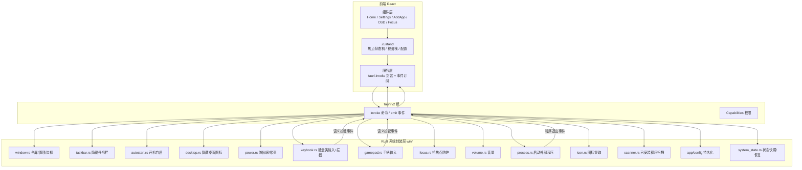
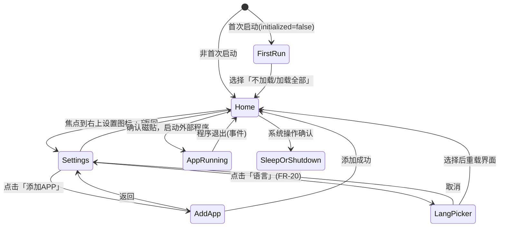

# WinNas Launcher（TV Launcher）设计文档

> 版本：v0.1（草案）
> 状态：设计中
> 日期：2026-08-14
> 技术栈：**React + TypeScript + Vite**（前端） + **Tauri v2**（壳 + IPC） + **Rust / windows crate**（Windows 系统封装）
> 参考项目：[Darkvinx88/TvLauncher](https://github.com/Darkvinx88/TvLauncher)（界面风格 / 交互范式）

---

## 1. 项目概述

### 1.1 背景与目标

在 x86 小主机 / 迷你 PC / 电视盒子（Windows 版）上，接入投影仪或大屏电视，打造一台“电视盒子”。本应用是一个 **全屏极简 Launcher（启动器 / 自定义首页）**，开机直接进入，替代传统 Windows 桌面，用遥控器完成全部操作。

核心目标：

- **开机直达 Launcher**，全程看不到 Windows 桌面；
- **遥控器全操作**：方向键移动焦点、确认、返回、菜单、音量；
- **全屏无边框、置顶、抢焦点防护**，体验像真正的电视 OS；
- **极简桌面**：应用封面轮播 + 分类 + 设置面板，参照 TVLauncher 视觉风格；
- **可添加任意 Windows 程序**到首页，一键启动。

### 1.2 目标平台

| 项 | 说明 |
|---|---|
| 操作系统 | Windows 10 1809+ / Windows 11（x64 优先，兼容 arm64 可选） |
| 硬件形态 | 工控主机、迷你 PC、Windows 电视盒子，接 HDMI → 投影 / 大屏 |
| 显示 | 1080p 起，兼容 720p ~ 4K，UI 按基准 1920×1080 等比缩放 |
| 输入 | 蓝牙遥控器 / USB IR 遥控（模拟键盘 HID）、飞鼠（按键）、手柄（Xbox/PS，经 `gilrs`），统一为语义按键 |
| 运行时依赖 | WebView2 Runtime（Windows 10/11 通常已内置，需随包分发兜底安装器） |

### 1.3 术语表

| 术语 | 含义 |
|---|---|
| 磁贴 / Tile | 首页上一个应用卡片（16:9 封面图 + 名称），参考 TVLauncher 的横向轮播卡片 |
| 焦点（Focus） | 当前被方向键高亮的可操作元素 |
| 视图栈（ViewStack） | 首页 / 设置抽屉 / 添加 APP 页 等页面的栈式切换模型 |
| 系统封装层（Win Layer） | Rust 侧对 Windows API 的封装模块集合 |
| OSD | 音量等屏幕内即时反馈浮层 |

---

## 2. 需求分析

### 2.1 功能需求（FR）

| 编号 | 需求 | 说明 |
|---|---|---|
| FR-01 | 开机直达 Launcher | 开机自启 + 全屏置顶（不替换 Explorer Shell） |
| FR-02 | 无边框独占全屏 | 无边框、全屏、置顶、不可缩放/不可最小化 |
| FR-03 | 抢焦点防护 | 屏蔽系统弹窗/通知等抢走焦点；Alt+Tab、UAC 等场景自动夺回 |
| FR-04 | 焦点导航系统 | 方向键在磁贴/菜单/列表间移动焦点，环形/线性导航规则 |
| FR-05 | 遥控器按键捕获 | 确认/返回/菜单/音量/媒体键；可重映射 |
| FR-06 | 拦截系统快捷键 | 拦截 Win / Win+D / Win+Tab、Alt+F4 等危险组合键（Ctrl+Alt+Del 系统层无法拦截，写入已知限制） |
| FR-07 | 隐藏任务栏 | 启动时临时移出任务栏（非持久化，不做全局 AppBar 设置），退出/维护时恢复；配合系统状态快照（4.13）兜底还原 |
| FR-08 | 开机自启开关 | 设置面板可开关；写入注册表 Run 键 |
| FR-09 | 隐藏桌面图标（可选） | 首选临时隐藏桌面图标窗口（非侵入）；NoDesktop 注册表作备选。默认关闭、带风险提示，配合自启+全屏实现“只见 Launcher 不见桌面”（不替换 Explorer Shell） |
| FR-10 | 防休眠 / 屏幕常亮 | `SetThreadExecutionState` 阻止休眠与熄屏（启动设置一次，仅在系统电源事件时重断言） |
| FR-11 | 首页（TV 主界面） | 壁纸背景、顶部信息栏、底部应用封面轮播、顶部分类栏 |
| FR-12 | 右侧设置菜单 | 首页右侧设置入口 → 右侧滑出设置抽屉 |
| FR-13 | 添加 APP | 从「已安装程序列表」或「浏览文件(.exe/.lnk)」添加程序到首页 |
| FR-14 | 应用管理 | 分类、排序、改名、换封面、删除 |
| FR-15 | 启动外部程序 | 启动 exe/lnk；程序退出后自动回焦点并恢复全屏 |
| FR-16 | 音量控制 | 遥控音量键 → 系统音量调节 + 屏幕 OSD 提示 |
| FR-17 | 系统控制 | 关机 / 重启 / 睡眠 / 退出 Launcher |
| FR-18 | 配置持久化与备份 | 应用列表/设置/按键映射持久化，支持备份恢复 |
| FR-19 | Home 键唤起 Launcher | 按 **HTPC 遥控器 Home 键**（常见 `VK_BROWSER_HOME 0xAC`，**非键盘 `VK_HOME 0x24`**；MCE 绿键多映射 `VK_LWIN 0x5B`，FLIRC 可编程）时，Launcher 立即置顶 + 前台 + 获得焦点（**覆盖 AppRunning 态**，用户在看片/游戏中按 Home 直接回 Launcher）；键位纳入 keymap 可重映射 |
| FR-20 | 多语言切换（i18n） | 设置面板「语言」入口 → 弹出语言选择框（**仅支持 10 种语言**，见 5.9 语言清单）→ 选择后持久化到 `setting.conf` 并**重新加载界面**；**首次启动**读取系统语言自动匹配，命中则自动切换、未命中默认简体中文（详见 4.14 / 5.9） |

### 2.2 非功能需求（NFR）

| 编号 | 需求 | 指标 / 说明 |
|---|---|---|
| NFR-01 | 冷启动速度 | 开机自启后 3 秒内出主界面（含 WebView2 预热优化） |
| NFR-02 | 资源占用 | 空闲内存 ≤ 250MB；**24h 连续运行内存上涨 ≤ 80MB**（长期运行内存泄漏测试为强制项）；CPU 空闲近 0（避免风扇噪音影响观影） |
| NFR-03 | 稳定性 | RegisterApplicationRestart 崩溃自恢复 + WebView2 渲染进程独立监控；崩溃安全回退桌面 |
| NFR-04 | 远距离可读性 | 基准字号 ≥ 28px（1080p），控件间距 ≥ 48px 热区 |
| NFR-05 | 健壮性 | 系统状态（任务栏/桌面图标等）退出时自动还原，配置带备份/恢复 |
| NFR-06 | 安全性 | 全程普通权限运行，无需管理员 |
| NFR-07 | 可维护性 | 系统 API 全部收敛在 Rust `win/` 模块，前端不直接碰 Win32 |
| NFR-08 | 分发 | 常规安装包 + 绿色便携版（不写注册表、不写 %APPDATA%、自启走启动文件夹）双形态 |

### 2.3 范围界定

**MVP 范围（M1–M3）：**

- 全屏无边框窗口 + 自启 + 隐藏任务栏 + 防休眠 + 抢焦点防护
- 遥控/键盘焦点导航 + 确认/返回/菜单/音量 + Win/Alt+F4 拦截
- 首页（壁纸 + 顶部信息栏 + 应用轮播 + 分类）
- 添加 APP（已安装列表 + 浏览文件）、启动程序、回焦点
- 右侧设置抽屉（含添加 APP 入口、**语言切换入口**）
- 配置持久化
- 多语言界面（10 种，首次启动自动检测系统语言，FR-20）

**后续迭代（M4–M5）：** 按键重映射、壁纸轮播、备份恢复、手柄支持、媒体中心扩展。

**明确不做（本轮）：** 内置视频播放器（Launcher 只负责组织与启动，播放交给 PotPlayer/Kodi 等；预留「媒体中心」分类扩展点）。

---

## 3. 总体架构

### 3.1 技术选型

| 层 | 选型 | 理由 |
|---|---|---|
| 前端框架 | React 18 + TypeScript | 组件化 UI、生态成熟；TV 焦点导航可精确控制 |
| 构建 | Vite | 启动快，Tauri 官方模板标配 |
| 状态 | Zustand（轻量） | 焦点状态机 + 全局配置 |
| 壳 / 桥 | Tauri v2 | 体积小（~10MB）、Rust 安全边界、原生能力 |
| 系统 API | Rust + `windows` crate | 官方微软 crate，直接封装 Win32（用户明确要求 Rust 侧封装） |
| 图标/图像 | `image` crate | HICON → PNG 缓存 |
| 手柄输入 | `gilrs` crate | Xbox/PS 手柄（XInput/GameInput），D-pad/摇杆/按键 → 语义动作 |
| 文件选择 | `tauri-plugin-dialog` | 添加 APP 时的原生文件对话框 |
| 日志 | `log` + `tracing` 到文件 | 问题排查 |

> **为什么不用 Electron：** 本场景对启动速度、内存、风扇噪音敏感，Tauri（WebView2 原生渲染）更轻。且用户明确指定 Tauri v2。

### 3.2 分层架构



### 3.3 目录结构（目标）

```
winnas-launcher/
├─ docs/                      # 文档
├─ src/                       # React 前端
│  ├─ main.tsx / App.tsx
│  ├─ components/
│  │  ├─ focus/               # Focusable / useFocusManager / 焦点算法
│  │  ├─ home/                # 首页：壁纸/顶栏/分类栏/轮播磁贴
│  │  ├─ settings/            # 右侧设置抽屉
│  │  ├─ add-app/             # 添加 APP 页面
│  │  ├─ osd/                 # 音量等 OSD
│  │  ├─ i18n/                # 语言选择弹窗（FR-20）
│  │  └─ common/
│  ├─ i18n/                   # 多语言：locales/ 字典 + t() 工具（FR-20，见 5.9）
│  ├─ stores/                 # Zustand：focus / view / config / i18n
│  ├─ services/               # invoke 封装 + 事件订阅（ts 类型化）
│  ├─ styles/                 # 主题变量、缩放、焦点环
│  └─ types/                  # 与 Rust 共享的数据结构定义
├─ src-tauri/
│  ├─ src/
│  │  ├─ main.rs / lib.rs
│  │  ├─ win/                 # ★ Windows 系统封装（本章 4.x）
│  │  │  └─ i18n.rs           # 系统语言检测（FR-20，见 4.14）
│  │  ├─ app/                 # 应用模型、配置读写、扫描
│  │  └─ commands.rs          # 对前端暴露的 Tauri command
│  ├─ tauri.conf.json
│  ├─ capabilities/
│  └─ Cargo.toml
└─ package.json / vite.config.ts
```

### 3.4 进程模型

- **进程组成**：Tauri 主进程（Rust）+ WebView2 渲染进程（独立多进程，偶发崩溃不影响 Rust 主进程）。
- Rust 内需常驻的后台线程：
  1. **键盘钩子线程**（安装 `WH_KEYBOARD_LL`，线程持有消息泵，回调运行于该线程）；
  2. **电源保活线程**（持有 `SetThreadExecutionState` 标志，仅在系统电源事件时重断言，见 4.6）；
  3. **前台/全屏看门狗线程**（低频检查焦点与全屏状态并纠正）。
- **优雅退出（强制要求）**：所有后台线程持有统一取消信号（`Arc<AtomicBool>` 停止标志 + `std::sync::mpsc` 通道 + `JoinHandle`）。退出流程：置位取消 → `join` 等待线程结束 → 卸载钩子/释放 Win32 句柄 → 退出主进程，杜绝进程残留与句柄泄漏。
- **WebView2 渲染进程异常监控**：监听 WebView2 `ProcessFailed`（渲染/GPU 进程崩溃）→ Rust 主进程不退出，自动 `reload` 或重建 WebView 窗口并恢复界面状态；Rust 主进程崩溃则交由 6 章崩溃恢复机制。
- 前端只做 UI 与状态，所有系统副作用经 IPC 走 Rust。

### 3.5 数据流（以“按遥控器确认启动应用”为例）

```
遥控器按键 →(系统)→ 低层钩子线程
   ├─ 危险键(Win/Alt+F4)? → 吞掉，不投递
   └─ 普通键 → 投递给系统 → WebView2 聚焦态 keydown
前端 keydown → 焦点状态机 → 命中磁贴 → invoke('launch_app', id)
Rust process.rs → CreateProcessW(程序) 
   → 启动成功：emit('app-launched') → 前端切到“等待返回”态
全部程序退出 → process.rs 多进程监听（WaitForSingleObject + exe 路径匹配）
   → emit('apps-all-exited') → Rust 延时 300~800ms 后夺回焦点/重设全屏 → 前端恢复首页焦点
```

---

## 4. Rust 侧 Windows 系统封装（核心章节）

> 原则：**所有 Win32 调用只允许出现在 `src-tauri/src/win/*.rs` 中**；对前端只暴露语义化 command。封装统一提供 **应用 / 还原（apply/restore）** 两个方向的能力，并配合 4.13「系统状态快照」兜底——还原不依赖正常退出。

### 4.1 模块总览

| 模块 | 职责 | 关键 Win32 API / crate |
|---|---|---|
| `win/window.rs` | 无边框、全屏、置顶、尺寸看门狗 | `SetWindowLongPtrW`、`SetWindowPos`、`ShowWindow`、`DwmSetWindowAttribute`、`MonitorFromWindow` |
| `win/taskbar.rs` | 隐藏任务栏（非持久化） | `FindWindowW("Shell_TrayWnd")`、`SetWindowPos` 临时移出/复位；`ABS_AUTOHIDE` 仅作可选备选 |
| `win/autostart.rs` | 开机自启读写 | `RegCreateKeyExW` / `RegSetValueExW`（`HKCU\...\CurrentVersion\Run`） |
| `win/desktop.rs` | 隐藏桌面图标（可选） | 首选 `ShowWindow` 隐藏图标窗口；备选 `HKCU\...\Policies\Explorer\NoDesktop = 1` |
| `win/power.rs` | 防休眠、屏幕常亮 | `SetThreadExecutionState(ES_CONTINUOUS\|ES_SYSTEM_REQUIRED\|ES_DISPLAY_REQUIRED)`，启动一次 + 电源事件重断言 |
| `win/keyhook.rs` | 键盘类输入 + 拦截系统键（覆盖蓝牙/IR/飞鼠按键） | `SetWindowsHookExW(WH_KEYBOARD_LL)`（无需 DLL 注入，回调运行于安装线程）+ 降级策略 |
| `win/gamepad.rs` | 手柄输入（Xbox/PS） | `gilrs` crate（XInput/GameInput），D-pad/摇杆/按键 → 语义动作 |
| `win/focus.rs` | 抢焦点防护、自动夺回（含 AppRunning 状态机） | `SetWinEventHook(EVENT_SYSTEM_FOREGROUND)`、`AttachThreadInput`、`SetForegroundWindow`、`SPI_SETFOREGROUNDLOCKTIMEOUT` |
| `win/volume.rs` | 音量读写、静音、设备绑定 | Core Audio：`IMMDeviceEnumerator`→`IAudioEndpointVolume`（绑定用户选择设备 ID） |
| `win/process.rs` | 多程序启动/退出监听/进程树回收 | `CreateProcessW`、`ShellExecuteExW`、Job Object、exe 路径匹配、`taskkill /T` |
| `win/icon.rs` | exe/lnk → PNG 图标 | `ExtractIconExW` / `SHGetFileInfoW(SHGFI_ICON)`、`GetIconInfo`→`GetDIBits`→`image` crate 存 PNG |
| `win/scanner.rs` | 扫描已安装程序 | 开始菜单 `*.lnk` 扫描 |
| `win/config.rs` | 配置持久化 | `setting.conf`（exe 目录，轻量配置项，**含 `language`**）+ `apps.json`（exe 目录，网格菜单列表）；JSON 原子写，内存缓存（`RwLock`） |
| `win/i18n.rs` | 系统语言检测（FR-20，见 4.14） | `GetUserDefaultLocaleName`（BCP-47）/ `GetUserDefaultUILanguage`（LANGID）→ 映射到 10 种支持语言，未命中回退简体中文 |
| `win/system_state.rs` | 系统状态快照与恢复（产品级底线） | 启动快照 + 下次启动自动还原 + 【一键恢复】按钮 |

### 4.2 全屏与窗口管理（`window.rs`）

目标窗口态：

- **无边框**：`decorations: false`（Tauri 配置），必要时用 `SetWindowLongPtrW(GWL_STYLE)` 强制移除 `WS_CAPTION/WS_THICKFRAME`；
- **全屏（M1 实测修订）**：用 Tauri `fullscreen: true`（`tauri.conf.json`）/ `set_fullscreen(true)`。其内部（tao → tauri-runtime-wry）就是正确的原生 `Fullscreen::Borderless(None)` 全屏：定位窗口所在显示器 → 物理尺寸 → `SetWindowPos` 全屏 → 保存 `WINDOWPLACEMENT` 供退出恢复。**不要绕过 tauri 直接对 HWND 调 `SetWindowPos` 做全屏**——那会用 `GetSystemMetrics`（仅主屏）+ 硬编码 (0,0) 坐标，多显示器错位，且与 tauri 窗口状态不同步、WebView2 内容区不跟随 resize（M1 实测表现为“没覆盖整个屏幕”）。置顶是独立操作（全屏不改变 Z 顺序），仍需原生 `SetWindowPos(HWND_TOPMOST)`；
- **置顶（跟随焦点，M2 修订）**：Launcher 聚焦时 `SetWindowPos(HWND_TOPMOST)` 置顶；失焦（Alt+Tab 切走 / 启动外部程序）时 `SetWindowPos(HWND_NOTOPMOST)` **取消置顶**，让其他程序能显示在最前。由 `focus.rs` 的前台监听（`EVENT_SYSTEM_FOREGROUND`）驱动——避免 Launcher 一直霸占置顶、用户切不走其他程序的体验问题；
- **Win11 圆角**：`DwmSetAttribute(hwnd, DWMWA_WINDOW_CORNER_PREFERENCE, DWMWCP_DONOTROUND)`，避免无边框窗口四角漏底；
- **多显示器**：启动时通过 `EnumDisplayMonitors` 选择目标屏（默认：包含主显示器，或设置中指定）；投影场景通常要求固定到“电视/投影”那块屏；
- **DPI 感知（必须）**：进程启动时调用 `SetProcessDpiAwarenessContext(PER_MONITOR_AWARE_V2)`，否则 `SetWindowPos` 坐标会被系统按 DPI 虚拟化，多屏/缩放场景下全屏尺寸错误（投影常为 100% 缩放，但仍须全局处理）。

**全屏看门狗（重点）：** 屏幕分辨率变化、UAC 弹窗、Alt+Tab 切走等会破坏全屏态。设计一个低频线程（约 2s 一次）检查 `IsIconic` / `GetWindowRect` 是否与目标显示器一致，不一致则静默重设全屏+置顶。**注意：Win11 部分版本下 `HWND_TOPMOST` 会被 UAC/系统弹窗强制压到非置顶层**，看门狗需同时复查 `WS_EX_TOPMOST` 并重设。前端不做该逻辑，全部收在 Rust。

**WebView2 已知问题规避：** 某些显卡/缩放下 WebView2 全屏会留黑边或尺寸滞后，措施：窗口尺寸变化后主动调用 WebView2 `EnsureSize` / 触发一次 `window.resize`；避免使用 WebView2 自身的“全屏 API”（HTML5 fullscreen），一律以 tauri 的窗口全屏为准。**（PoC 已实证）** 4K（3840×2160）下原生全屏无黑边、导航正常。

**WebView2 初始化策略：** 生产构建禁用 devtools、右键菜单、文本选中、触摸缩放与滚动回弹，避免误触破坏 TV 体验；WebView 背景色置黑，避免首帧白闪。**右键菜单必须走宿主层 `AreDefaultContextMenusEnabled=false`**（setup 内 `with_webview` 取 `ICoreWebView2Controller` → `CoreWebView2().Settings()` 设置）：遥控器「菜单键」= `VK_APPS 0x5D` 会触发宿主级菜单，DOM 的 `contextmenu`/keydown `preventDefault` 拦不住（仅作前端兜底）。

### 4.3 隐藏任务栏（`taskbar.rs`）

> 关键约束（评审修订）：**禁止使用会持久化/全局生效的设置**。`ABS_AUTOHIDE` 是全局系统设置，崩溃/强杀进程时 `restore()` 不会执行，会遗留“任务栏永久自动隐藏”状态——**不作默认方案**。

**方案（非侵入，默认）：临时移出可视区**
- 获取任务栏 `FindWindowW("Shell_TrayWnd")` 与通知区域 `System_TrayWnd`；
- 记录原始状态 → 优先 `SetWindowPos` 移出可视区（或 `ShowWindow(SW_HIDE)` 隐藏；两种均为临时窗口态，**不写任何持久配置**；appbar 偶发自动归位时由看门狗复查）；
- 退出 / 维护模式时 `SetWindowPos` 复位到原始位置；
- 崩溃兜底：位置属临时窗口态，Explorer 重启 / 下次登录自动复位；同时由「系统状态快照」（4.13）下次启动兜底还原。
- 备选（设置中可选）：`SHAppBarMessage(ABM_SETSTATE, ABS_AUTOHIDE)` 自动隐藏——但必须配合 4.13 快照机制，下次启动优先恢复原始 AppBar 状态。

### 4.4 开机自启（`autostart.rs`）

- 写注册表：`HKCU\Software\Microsoft\Windows\CurrentVersion\Run`
  - 值：`WinNasLauncher` = `"<exe路径>" --autostart`
- 自启时传 `--autostart` 参数，应用内部做 1~2s 延迟 + 等 Explorer 加载完成再显示窗口（避免开机瞬间抢焦点失败）；
- 提供 `set_enabled(bool)` / `is_enabled()` / `disable()`；
- 备选：`tauri-plugin-autostart` 可作降级方案，但按需求以自研注册表封装为主。

### 4.5 隐藏桌面图标 / 桌面呈现（`desktop.rs`）

> 明确：**不替换、不卸载 Explorer**，仅采用“自启置顶”方案（即原方案 A）。
> **默认关闭、可选启用（评审修订）**：`NoDesktop` 属策略键，企业/工控系统可能被策略锁定，且生效需重启 Explorer、崩溃时无法及时还原——故改为可选功能，默认关闭，开启时在设置面板展示风险提示。

**实现优先级：**
1. **首选（非侵入）：隐藏桌面图标窗口**——枚举桌面图标窗口（`Progman` → `SHELLDLL_DefView` / `SysListView32`），`ShowWindow` 临时隐藏。不写注册表，进程退出 / Explorer 重启自动恢复，崩溃零遗留。
2. **备选：`HKCU\...\CurrentVersion\Policies\Explorer\NoDesktop = 1`**——仅在用户明确开启且方案 1 不可用时使用；退出/维护时还原为 `0`，必须配合「系统状态快照」（4.13）下次启动兜底还原。

- 全部操作在普通权限下完成，无需管理员、无 Winlogon 风险。

### 4.6 防休眠 / 屏幕常亮（`power.rs`）

- 常驻线程持有会话标志：`SetThreadExecutionState(ES_CONTINUOUS | ES_SYSTEM_REQUIRED | ES_DISPLAY_REQUIRED)`；
- **只需启动时设置一次（评审修订）**：`ES_CONTINUOUS` 标志持续有效，仅在“持有线程退出”或“其他程序/系统策略清除执行状态”时失效；**不做无脑周期性轮询**；
- 重断言时机：仅在收到系统电源事件（`WM_POWERBROADCAST` / `EVENT_SYSTEM_POWERSTATUSCHANGE`）或线程重启时执行；
- 设置面板提供开关：`keepAwake(bool)`，关闭后恢复 `ES_CONTINUOUS` 默认态；
- 注：这能阻止“系统休眠/关闭显示器”，但若系统组策略强制休眠或来电自启等，属于系统层配置，不做侵入式修改（可提供文档指引）。
- **电源按钮操作（配合 FR-17 遥控器电源键）**：启动时用 `powercfg` 把「电源按钮操作（PBUTTONACTION）」设为**睡眠**，退出时还原原始值。原因：HTPC 遥控器电源键是 HID 消费类 `Power` usage（系统电源键），**非键盘 `VK_SLEEP 0x5F`**，键盘 LL 钩子拦不到，只能改电源方案。睡眠中按电源键仍可唤醒（电源键是硬件唤醒源，与「操作」设置无关）。

### 4.7 输入捕获与按键拦截（`keyhook.rs` / `gamepad.rs`）

**统一语义按键模型（核心）：** 所有输入源最终归一为语义动作，前端只消费语义动作、不关心物理设备：

```rust
enum Action {
    Up, Down, Left, Right, Confirm, Back, Menu,   // 导航
    VolumeUp, VolumeDown, Mute, Power,            // 音量/电源
    Home,                                          // 唤起 Launcher（FR-19）
    MediaPlayPause, MediaNext, MediaPrev,         // 媒体（预留）
    Settings, Search,                             // 预留
}
```

**输入源 → 语义动作：**

| 输入源 | 形态 | 接入方式 | 说明 |
|---|---|---|---|
| 蓝牙遥控器 | HID 键盘（方向/确认/返回/音量/媒体键） | WebView2 聚焦态 keydown（主）+ 低层钩子兜底 | Android TV 风格蓝牙遥控即此类，免驱动 |
| USB IR 遥控（FLIRC/MCE） | 模拟键盘扫描码 | 同上 | 键位按品牌映射（见 keymap） |
| 飞鼠（RF/USB） | 按键 = 键盘事件；移动/滚轮 = 鼠标事件 | 按键同上；指针默认屏蔽，可选“指针跟随”模式 | 滚轮可映射为分类/页面切换 |
| 手柄（Xbox/PS/通用） | XInput / GameInput（`gilrs`） | 独立轮询线程 → 语义动作 | D-pad/左摇杆=方向，A=确认，B=返回，Start/Menu=设置 |

**键盘钩子架构（`keyhook.rs`）：**
- `WH_KEYBOARD_LL` 是全局远程钩子的特例：**无需 DLL 注入**，回调运行在**安装钩子的线程上下文**；该线程必须持续运行消息循环（`GetMessageW → DispatchMessageW`）钩子才生效。可用独立线程，也可直接复用 Tauri 主线程消息泵（独立线程可避免回调阻塞 UI）。
- **降级策略（强制）**：钩子初始化失败（精简系统 / 安全软件禁用）时**不可崩溃**，自动关闭全局拦截，仅保留 WebView2 窗口内按键处理，并在设置面板提示“全局拦截不可用”。
- **能力边界（已知限制）**：LL 钩子收不到**高完整性级别进程**（游戏、模拟器、UAC 程序）的输入；因此“拦截 Win/Alt+F4”仅对 Launcher 自身聚焦时可靠。
- 回调中**只做最小逻辑**：判断按键是否命中拦截表 → 命中则 `return 1`（吞掉）并异步发送事件；否则 `CallNextHookEx` 放行。**任何耗时操作禁止出现在回调内**（全局同步回调，耗时会造成整机按键卡顿）。

**拦截策略：**

| 按键/组合 | 处理 |
|---|---|
| `Win`（L/R，0x5B/0x5C）、`Win+D`、`Win+Tab` | 吞掉（低层钩子可拦截 Win 键；`RegisterHotKey` 无法注册 Win 键，故必须用钩子） |
| `Alt+F4` | 吞掉（**Launcher 自身聚焦时可靠**；外部程序聚焦时**不拦截**——那是该程序的正常关闭行为） |
| `Ctrl+Shift+Esc` | 吞掉（防误开任务管理器）；用户经设置面板“进入桌面/维护模式”按需打开。**注意（PoC 发现）**：该组合与 `Ctrl+Esc` 属系统保留键（由 `csrss.exe` 提前消费），`SendInput`/`keybd_event` 注入路径不可拦；真实物理按键的拦截已在 M0 部分验证，需 M1 真机遥控器接入后复核 |
| `Ctrl+Alt+Del` | **无法拦截**（系统安全边界，写入已知限制），配合 4.8 自动夺回 |
| `Alt+Tab` | 低层钩子可部分捕获，尽力吞掉；残余场景靠 4.8 看门狗夺回 |
| 音量键 0xAD/0xAE/0xAF | 吞掉并转发 → `volume.rs` 控制音量 → `emit('volume-changed')` → 前端显示 OSD |
| 媒体键（播放/暂停/上一首/下一首） | 放行给系统（若未来内置播放器再接管） |
| Home 键（遥控器 `VK_BROWSER_HOME 0xAC`；MCE 绿键 `VK_LWIN 0x5B`） | 全局拦截 → 唤起 Launcher（**覆盖 AppRunning 态**） |

**Home 键唤起 Launcher（FR-19）：**
- 语义动作 `Home`：`keyhook.rs` 的 `classify` 新增 `HOME` 分支（键位纳入 `keymap.json` 可重映射）→ 触发 `focus::show_launcher()`；
- **键位澄清**：目标是**遥控器 Home 键**，默认拦截 `VK_BROWSER_HOME 0xAC`（HID 消费类 Home usage 的 Windows 映射）；MCE 遥控器绿键多映射 `VK_LWIN 0x5B`，FLIRC 用户可自行映射。**不拦截普通键盘 `VK_HOME 0x24`**（避免误伤键盘用户，且遥控器 Home 通常并不发这个码）；
- `focus::show_launcher()` 复用 4.8 夺焦序列：`AttachThreadInput + SetForegroundWindow + SetWindowPos(HWND_TOPMOST)`，但**跳过维护模式/`AppRunning` 不夺回判断**——Home 是显式用户动作，优先级高于自动焦点防护；
- **范围界定（已确认）**：仅支持「Launcher **已运行状态**下全局唤起」；Launcher 未运行时无钩子/热键，Home 无法冷启动，**不做常驻后台组件**（列为已知限制）。

**手柄输入（`gamepad.rs`）：**
- 使用 `gilrs` crate（封装 XInput / Windows.Gaming.Input），后台线程低频轮询 + 事件回调；
- 断连/重连事件驱动：断连时暂停映射并 `emit('gamepad-connection', false)`，重连恢复；
- 手柄事件经通道 → 语义动作 → `emit('input-action', action)`，与键盘路径在 Rust 侧汇合后统一送前端。

**按键分发：**
- 键盘类普通键（方向/确认/返回等）**默认放行**给 WebView2（聚焦态 keydown 最流畅）；钩子仅兜底：当 WebView2 失焦但 Launcher 仍在时，以 `emit('key-forward', ...)` 注入前端。
- **防重复（重点）**：Launcher 聚焦态下，钩子**只处理拦截键/音量键**，普通键一律 `CallNextHookEx` 放行且不转发，避免与 WebView2 keydown 双通道重复触发。
- 全部键位做成可重映射表 `keymap.json`（参照 TVLauncher Key Remapper），`keyhook.rs` / `gamepad.rs` 与前端共享这份映射；手柄默认映射同样可改。

**VK 码参考表（用于键盘类遥控器键位映射）：**

| 遥控器按键（FLIRC/MCE 常见） | 产生的 VK 码 | 默认动作 |
|---|---|---|
| 上/下/左/右 | `VK_UP 0x26` / `VK_DOWN 0x28` / `VK_LEFT 0x25` / `VK_RIGHT 0x27` | 移动焦点 |
| OK / 确认 | `VK_RETURN 0x0D` | 确认 / 启动 |
| 返回 | `VK_ESCAPE 0x1B` 或 `VK_BROWSER_BACK 0xA6` | 返回上一层 |
| 菜单 / 设置 | `VK_APPS 0x5D` | 打开右侧设置抽屉（宿主层已禁用 WebView2 默认右键菜单，不会误弹） |
| 音量 +/- / 静音 | `0xAF / 0xAE / 0xAD` | 系统音量 + OSD |
| 播放/暂停等 | `0xB3 / 0xB2 / 0xB1 / 0xB0` | 放行（媒体） |
| 电源（关机键） | 系统电源键（HID 消费类 `Power` 0x30，**非键盘 `VK_SLEEP 0x5F`**） | 走系统「电源按钮操作」，由 4.6 设为**睡眠（S3）**；睡眠中再按可唤醒 |
| 睡眠键（兜底） | `VK_SLEEP 0x5F`（部分遥控器/键盘有独立睡眠键） | 钩子拦截 → `SetSuspendState` 直接 S3 睡眠 |
| Home（遥控器首页键） | `VK_BROWSER_HOME 0xAC`（**非键盘 `VK_HOME 0x24`**；MCE 绿键/Start 多映射 `VK_LWIN 0x5B`，FLIRC 可编程） | 唤起 Launcher：置顶 + 前台 + 焦点（见 FR-19） |

> 已确认（见 9.1）：蓝牙遥控（HID 键盘）、USB IR（FLIRC/MCE）、飞鼠按键均走键盘事件路径；手柄走 `gamepad.rs`，统一归一到语义动作。

### 4.8 抢焦点防护（`focus.rs`）

**目标：** Launcher 在显示期间，系统弹窗、通知、UAC、输入法候选窗等不得抢走焦点；被抢后自动夺回。

实现（分层）：

1. **置顶**：窗口 `HWND_TOPMOST`（4.2）；
2. **失焦恢复**：`SetWinEventHook(EVENT_SYSTEM_FOREGROUND, WINEVENT_OUTOFCONTEXT)`，当前台窗口变为“非 Launcher、非刚刚启动的外部程序、非白名单系统窗口”时，执行夺回：
   - 系统级放宽：`SystemParametersInfoW(SPI_SETFOREGROUNDLOCKTIMEOUT, 0, ...)`（每次夺焦前重申，防被其他程序改回）；
   - **健壮夺焦序列**（`bring_to_front`，Home 键/看门狗/夺回共用）：`PeekMessageW(PM_NOREMOVE)` 确保本线程有消息队列（spawn 线程队列惰性创建，无队列时 `AttachThreadInput` 会失败）→ `AttachThreadInput(foreignThread, launcherThread, true)` → `SetForegroundWindow(launcher)` → 分离；**用 `GetForegroundWindow` 验证，失败则模拟一次 Alt 键按下/抬起（令系统认为本进程接收过用户输入）后重试**（最多 3 次 × 50ms）；
   - `SetWindowPos(HWND_TOPMOST, ...)` 上浮。
   - **AppRunning 态例外（重点修订）**：`AppRunning` 期间即使 Launcher 拿到前台也**不置顶**——Playnite 等先弹闪屏的应用，闪屏关闭瞬间前台会短暂回到 Launcher，若此时置顶会把刚出现的主窗口压到下面（「外部程序无法显示在最前」的根因）。全部外部程序退出回到 Idle 后才恢复「Launcher 聚焦即置顶」。
3. **白名单例外**：UAC 提权窗口（`#32770` 由 consent.exe 弹出的）应允许其出现，用户确认后自动夺回；输入法、任务管理器（用户主动打开）放行。
4. **兜底看门狗**：仅 `Idle` 态生效（见下方状态机）——低频线程（如 3s）检查前台窗口，若前台非本应用且非白名单窗口，静默夺回；`AppRunning` 态不触发。**（PoC 发现）前台窗口以 `EVENT_SYSTEM_FOREGROUND` 回调记录为权威信号**：外部进程被强杀后 `GetForegroundWindow` 会短暂返回失效句柄，直接比较 `HWND` 会误判，应缓存 WinEvent 回调里的最新前台句柄作为判定依据。

**焦点状态机（重点修订，TV Launcher 关键逻辑）：**
```
状态：Idle（无外部程序） ↔ AppRunning（有外部程序运行）
- Idle：焦点夺回防护全程生效（弹窗/通知/Alt+Tab 被抢后自动夺回）；
- AppRunning：临时关闭主动焦点夺回 —— 避免 Launcher 与全屏播放器/游戏疯狂互抢前台（这是最易踩的致命 bug）；
  仅在全部外部程序退出后回到 Idle 才恢复夺回。
- **Home 键例外（FR-19）**：`AppRunning` 态下 Home 键仍显式夺回（置顶 + 前台 + 焦点）——用户主动按 Home 是明确意图，不参与自动防护的互抢抑制。
- 恢复时序：进程退出检测（4.9）后先等待 300~800ms（可配置）再夺回焦点 + 恢复全屏
  ——大型程序销毁进程有延迟，过早置顶会再次丢失焦点。
- 白名单例外（UAC 弹窗、输入法、任务管理器）在任何状态下都放行。
```
- 用户启动 PotPlayer 等 → Launcher 主动让出前台并进入 `AppRunning`；
- 程序退出（4.9 监听）→ 延时后夺回焦点 + 恢复全屏，回到 `Idle`。

### 4.9 启动外部程序与回焦点（`process.rs`）

- `.exe`：`CreateProcessW`（GUI 程序用普通创建标志即可；`CREATE_NEW_PROCESS_GROUP` 仅对控制台程序有意义，默认不加）。**（PoC 发现）windows crate 中 `CreateProcessW`/`CreateJobObjectW` 被 `Win32_Security` feature 门控，主 app 的 windows 依赖需显式启用该 feature，否则编译报 unresolved import**；
- `.lnk`：**优先解析目标（`IShellLinkW::GetPath`）后直接 `CreateProcessW` + Job Object 启动**（与 `.exe` 同路径，重点修订）——`ShellExecuteExW` 对慢启动应用（Playnite 等）返回的 `hProcess` 是 **Shell 进程而非目标进程**（会激活 Shell 的「正在打开」对话框、退出检测误判、看门狗误夺焦点），此改动是「外部程序无法置前」的关键修复；解析失败/非 `.exe` 目标（bat/url/带参快捷方式）才退回 `ShellExecuteExW`（`SW_SHOWNORMAL`）。注意 `CreateProcessW` 命令行须给 exe 路径加引号（`.lnk` 解析出的目标路径多为 `C:\Program Files\...` 含空格）；`.url` 走 `ShellExecuteExW`；
- **前台激活（启动后主动让前台，重点修订）**：`CreateProcessW` 启动的程序不会自动抢前台，而 Launcher 全屏置顶会挡住它，须主动激活——`EnumWindows` 枚举目标进程全部可见顶层窗口，按「面积最大 + 标题非空加分」挑**主窗口**（跳过闪屏，Playnite/Steam 等先弹闪屏再开主窗口），执行「取消 Launcher 置顶 → `SW_RESTORE` → 临时 `HWND_TOPMOST`（先置顶保证可见）→ `AttachThreadInput`(挂接**当前前台线程**) → `SetForegroundWindow`（失败模拟 Alt 键重试最多 3 次）」；**持续轮询（最多 30s，.NET 冷启动实测可超 10s）**：窗口变化（闪屏→主窗口）或前台被抢时重新激活（间隔≥300ms 防高频刷）；**不提前收尾**——期间目标窗口持续保持置顶+前台，确保主窗口无论何时出现（30s 内）都被激活，轮询结束才统一取消置顶收尾；每 ~2s 留诊断日志。**窗口匹配范围 = 启动 pid ∪ 同 exe 文件名的进程**（启动器「父进程退出、UI 子进程接管」时窗口不在启动 pid 下，按 exe 名把子进程窗口也纳入，否则永远找不到——Playnite 实测曾 30s 内一个可见窗口都找不到）。一直找不到可见窗口时每 5s 深挖一次诊断：`目标pid 存活` + **同 exe 进程集的顶层窗口含不可见** + **线程窗口含消息专用窗口（托盘图标）** + **全桌面可见窗口清单** + **同词干（如 `playnite*`）家族进程清单**。这组诊断用于区分四类情况：① 启动最小化/隐藏（窗口存在但 `可见=false`）；② 最小化到托盘（无顶层窗口但有消息专用窗口）；③ 父进程退出、UI 子进程接管（同 exe 名子进程持窗口）；④ **UI 由异名进程承载（如 Playnite 的 DesktopApp 只作引导、真正全屏界面在 FullscreenApp / 提权进程里，不在我们的 Job 内，launcher 退出也不被杀）**——全桌面窗口清单直接暴露它。配套 4.8：`AppRunning` 期间 Launcher 不置顶，主窗口出现时天然排在普通层顶部，即使前台未成功切换也能显示在最前。
- **多开支持（重点修订）**：以 `HashMap<appId, AppInfo>` 维护**多个同时运行**的外部程序；启动时记录**完整可执行文件路径** + 进程句柄；
- **退出监听（推荐 Job Object）**：启动时将进程加入**作业对象（Job Object）**，等待 `JOB_OBJECT_MSG_ACTIVE_PROCESS_ZERO`——只要进程树任一后代存活作业就不结束，天然覆盖“父进程退出、子进程存活”的场景（Steam / 模拟器 / 启动器）；作业结束才通知前端（`emit('apps-all-exited')`）并触发焦点恢复（4.8 延时逻辑）；
- **兜底**：Job Object 不可用（极少数环境）时降级为句柄 `WaitForSingleObject` + 按 **exe 路径匹配** 轮询判定；
- **关闭策略（回收子进程）**：
  1. 优先持有句柄 → `TerminateProcess`；
  2. 句柄失效 → 按 exe 路径匹配批量结束；
  3. 调用 `taskkill /PID <pid> /T` 回收整个进程树，杜绝子进程残留后台；
- **关闭交互（前端约定）**：**长按返回键 = 关闭外部程序**；单击返回交给应用自身处理，不抢。
- **启动失败处理**：返回错误码给前端 → Toast 提示（如“无权限 / 需要管理员运行”），并给出“用管理员权限重试”的引导（`ShellExecuteExW(runas)`）。

### 4.10 音量控制（`volume.rs`）

- Core Audio：`IMMDeviceEnumerator` → `IMMDevice`（**绑定到用户选择的音频输出设备 ID**，而非默认设备）→ `IAudioEndpointVolume`；
- `GetMasterVolumeLevelScalar / SetMasterVolumeLevelScalar / GetMute / SetMute`；
- **多输出设备（重点修订）**：枚举系统渲染设备列表，设置面板提供**音频输出选择下拉框**，选择持久化到配置；切换耳机/音响后音量控制不失效；
- 对前端暴露：`get_devices()`、`set_device(id)`、`get_volume()`、`set_volume(v)`、`set_mute(bool)`；
- 遥控音量键 → 钩子吞掉 → `set_volume` → `emit('volume-changed', v)` → 前端 OSD（单例 + 防抖，见 5.7）。

### 4.11 图标提取（`icon.rs`）

- `.exe`：`ExtractIconExW`（大/小图标各一枚）或 `SHGetFileInfoW(..., SHGFI_ICON | SHGFI_LARGEICON)`；
- `.lnk`：对 `.lnk` 直接取 Shell 图标（无需解析目标）；必要时用 `IShellLink` COM 解析目标再提取；
- 转换：`GetIconInfo → hbmColor` → `GetDIBits` 读像素 → `image` crate 编码 PNG（建议 256×256 / 512×512，透明背景）；
- **缓存**：`%APPDATA%\WinNasLauncher\conf\cache\icons\{sha1(path)}.png`，避免重复提取；无图标程序用 shell32.dll 通用应用图标兜底。

### 4.12 已安装程序扫描（`scanner.rs`）

**唯一来源：开始菜单快捷方式** `%ProgramData%\...\Start Menu\Programs\**\*.lnk` 与 `%APPDATA%\...\Start Menu\Programs\**\*.lnk`（递归），解析名称并提取图标。

> 评审修订：早期版本还额外扫描注册表 Uninstall 键（`HKLM`/`HKCU`/`WOW6432Node` 三处），导致「添加 APP」候选列表比首页首次「加载全部菜单」多出大量注册表残留项、两处不一致。**统一为只扫开始菜单**：首页首次加载与「添加 APP」页共用同一 `scan()`，保证两处列表一致（快捷方式名含 卸载/帮助/修复/repair/uninstall/help 的过滤）。

产物为候选列表，交给“添加 APP”页选择。**扫描是异步任务**（首次可能 1~2 分钟），结果缓存到 `conf\cache\scanner.json`，前端显示进度条。

### 4.13 系统状态快照与恢复（`system_state.rs`）——产品级底线

> 评审强制项：**不依赖“正常退出才还原”**。所有异常场景（强杀进程、蓝屏、断电、崩溃）下退出还原代码都不会执行，必须靠“下次启动自愈”。

- **启动第一步**：记录本次将要修改的全部系统参数到内存快照（任务栏位置、AppBar 状态、桌面图标状态、电源标志、窗口置顶等）；
- **兜底还原（双保险）**：
  1. **下次启动自动还原**：通过残留状态标记判断上次是否异常退出，若是则按快照自动还原系统状态，再进入 Launcher；
  2. **设置面板应急按钮【一键恢复系统桌面状态】**：任何时刻一键还原任务栏、桌面图标、电源等，退出 Launcher 回到桌面；
- 快照文件存 `conf/state_snapshot.json`（原子写）。

### 4.14 系统语言检测（`i18n.rs`）——FR-20

> 负责「检测操作系统语言」这一件 Win32 侧的事。**首次启动**（`setting.conf` 中 `language` 为空）自动检测；此后若语言为「自动」来源（`language_auto=true`），OS 语言变化时自动校准；若为「用户手动选择」（`language_auto=false`），永不覆盖。所有 Win32 调用收敛在本模块，前端不直接碰。

- **检测 API（首选）**：`GetUserDefaultLocaleName` 返回 BCP-47 标签（如 `zh-CN`、`en-US`、`ja-JP`、`ar-SA`）。⚠️ 实测：简体中文系统上 `GetUserDefaultUILanguage`（LANGID）可能因 MUI 语言包顺序误报繁体（`0x0804`），而 BCP-47 与系统实际显示语言一致，故**以 BCP-47 为准**；
- **辅助判定（BCP-47 读取失败时）**：`GetUserDefaultUILanguage` 返回 LANGID，用 `PRIMARYLANGID` + `SUBLANGID` 判定，中文 sublang 区分简繁。
- **匹配规则（10 种支持语言）**：

| 系统语言 | 命中 locale | 说明 |
|---|---|---|
| `zh` + 脚本 `Hant` 或地区 ∈ {TW, HK, MO} | `zh-TW`（繁体中文） | 港台澳繁体 |
| `zh`（其余，含 `zh-CN` / `zh-SG` / `zh-Hans`） | `zh-CN`（简体中文） | 默认简体 |
| `en` / `ja` / `ko` / `es` / `ar` / `fr` / `de` / `ru` | 对应 locale | 英语 / 日语 / 韩语 / 西班牙语 / 阿拉伯语 / 法语 / 德语 / 俄语 |
| **未命中上述任何语言** | `zh-CN`（简体中文） | **默认回退** |

- **调用时机**：`config::init()` 加载配置后，`language` 为空 → 调用 `detect_os_language()` → 写回并标记 `language_auto=true` → 前端 `get_config` 拿到生效语言。`language_auto=true` 的配置每次启动会按 OS 校准一次（自愈误判）；旧版无 `language_auto` 字段的配置视为「自动来源」迁移校准一次。
- **对外命令**：`set_language(code)`（用户手动选择，写入 `setting.conf` 并置 `language_auto=false`，之后不再跟随系统）→ 前端随后重载界面（见 5.9）。仅一个命令，检测结果并入 `get_config` 返回。

---

## 5. 前端设计

### 5.1 页面 / 视图模型



- 用**视图栈（ViewStack）**而非路由库：`[{name:'home'}, {name:'settings'}, {name:'add-app'}]`，返回键弹栈，天然适配遥控器；
- **栈节点保存快照状态（重点修订）**：每个节点不只存页面名，还保存该页面的**滚动位置、焦点位置、选中项、表单草稿**——从 AddApp 返回 Settings 时恢复原滚动/选中状态，不丢失。

### 5.2 首页布局（居中网格菜单 + 分页）

```
┌───────────────────────────────────────────────┐
│  [Logo]   WinNas Launcher       时钟 天气 ⚙   │ ← 顶部信息栏（右上⚙=设置入口）
│                                               │
│      ┌──┐┌──┐┌──┐┌──┐┌──┐┌──┐                │
│      │  ││  ││  ││  ││  ││  │      第1行       │
│      └──┘└──┘└──┘└──┘└──┘└──┘                │
│      ┌──┐┌──┐┌──┐┌──┐┌──┐┌──┐                │
│      │  ││  ││  ││  ││  ││  │      第2行       │
│      └──┘└──┘└──┘└──┘└──┘└──┘                │
│      ┌──┐┌──┐┌──┐┌──┐┌──┐┌──┐                │
│      │  ││  ││  ││  ││  ││  │      第3行       │
│      └──┘└──┘└──┘└──┘└──┘└──┘                │
│      ┌──┐┌──┐┌──┐┌──┐┌──┐┌──┐                │
│      │  ││  ││  ││  ││  ││  │      第4行       │
│      └──┘└──┘└──┘└──┘└──┘└──┘                │
│                                               │
│     居中网格菜单（6列×4行 = 24项/页）           │
│     选中项金色焦点环 + 轻微放大                 │
│              ● ○ ○    第 1/3 页               │
└───────────────────────────────────────────────┘
```

- **居中网格菜单（核心交互区）**：应用磁贴按二维网格排列（默认 **6 列 × 4 行 = 24 项/页**），整体居中显示；选中项金色焦点环 + 轻微放大 + 光晕；
- **焦点切换**：上下左右在网格内二维移动焦点（详见 5.3 网格分页导航）；
- **分页**：应用数超过单页容量（列数 × 行数）时自动分页，底部页码点指示当前页；
- **顶部分类栏**：↑ 呼出，←→ 切换分类，↓ 收起（分类切换后回到该分类第 1 页）；
- **顶部信息栏**：右上角设置齿轮（FR-12 的“右侧设置入口”）；可扩展时钟 / 天气组件；
- **壁纸**：全屏背景图（16:9），支持自定义 + 可选轮播。

**菜单数据来源与首次启动引导（M3 新增）：**

- **菜单持久化**：网格展示的应用列表存 `apps.json`（exe 目录，与 `setting.conf` 并列）；`setting.conf` 存轻量配置（`initialized`、`menu_mode` 等）。启动时读 `apps.json` 渲染网格。
- **首次启动引导**：`setting.conf` 的 `initialized == false` 时弹全屏引导窗（焦点隔离，左右切换按钮 + Enter 确认），两个按钮：
  1. **不加载菜单**：`menu_mode = "manual"`，`apps.json` 写空 `[]` → 网格为空，后续经「添加 APP」手动加；
  2. **加载全部菜单**：`menu_mode = "all"`，调用 4.12 扫描系统程序（开始菜单 `.lnk`），结果写入 `apps.json` → 网格展示全部；
  - 选择后 `initialized = true` 写回 `setting.conf`，下次启动跳过引导、直接读 `apps.json`（**不重扫**，除非用户手动点「重新扫描」）。
- **菜单模式**：`manual`（手动维护，初始空）与 `all`（加载全部后缓存）；两种模式下「添加 APP」均追加到 `apps.json`。

### 5.3 焦点导航系统（核心）

**目标：** 所有交互元素方向键可达，鼠标完全可屏蔽（FR-04 + “屏蔽鼠标焦点”需求）。

**数据模型：**
```ts
interface Focusable {
  id: string;
  rect: { x: number; y: number; w: number; h: number }; // 视口坐标
  group?: string;              // 参与组内循环（轮播行）
  neighbors?: Partial<Record<Direction, string>>; // 显式邻接（优先于算法）
}
```

**导航算法（四方向最近优先）：**
1. 有显式 `neighbors` → 直接跳转；
2. 否则在候选集中求：目标中心需位于方向半平面内，按 `score = Δ沿方向投影 + w·Δ垂直偏移` 取最小（`w≈2.5`，垂直偏移惩罚）；
3. 行内（同 group）支持线性/循环两种模式（参照 TVLauncher ≤5 线性、>5 循环）；
4. 无候选时不移动（可视焦点环闪烁反馈）。

**双层导航策略（重点修订）：**
- **简单布局**（首页网格等）：自动算法寻路；
- **复杂视图**（设置抽屉、添加 APP 页、双层列表）：**显式声明 `neighbors` 优先**，算法仅作兜底——避免 React 重渲染 / 动画 / ResizeObserver 时序导致的焦点迷路。

**网格分页导航（M3 新增）：** 首页网格按 `(row, col)` 二维定位焦点，单页容量 = `列数 × 行数`（默认 6×4 = 24 项/页）。

- **页内移动**：上下左右在 `[0, 行数) × [0, 列数)` 内移动；上下越界不翻页（顶/底行无候选则不移动）。
- **翻页规则（行边界溢出触发）**：
  1. 焦点在**当前页最右列**按 →：存在下一页则切页、焦点跳到下一页**同行的最左列**；已是末页则不动（焦点环闪烁反馈）；
  2. 焦点在**当前页最左列**按 ←：存在上一页则切页、焦点跳到上一页**同行的最右列**；已是首页则不动；
  3. 末页最后一行可能不满：目标行无项时，落到该页**最后一个可用项**（左对齐）。
  4. **Page Up / Page Down 直接翻页**：任一网格项聚焦时按 **PageUp / PgDn** 跳到上一页/下一页**同（row, col）位置**（末页不满时夹紧到最后一个可用项）；首页按 PageUp、末页按 PageDown 无操作。
- **分页状态**：`pageIndex` + `pageCount`（= ⌈应用数 / 单页容量⌉）；切页带轻微过渡动画，底部页码点 ●/○ 同步更新。

**焦点隔离层（重点修订）：** 抽屉、弹窗、全屏覆盖页激活时，自动进入“隔离焦点组”，**屏蔽下层所有 `Focusable`**，方向键无法穿透到下层磁贴；关闭隔离层后焦点回到触发元素。

**实现要点：**
- `useFocusManager`（Context + Zustand）维护 `focusId` + **焦点组栈**；`Focusable` 组件注册/注销自身并上报 rect（`ResizeObserver` 维护）；
- 全局 `keydown`（聚焦态）统一分发键盘类按键，同时订阅 Rust 的 `input-action` 事件（手柄/飞鼠/失焦兜底）驱动同一套动作分发；
- 焦点样式：CSS `outline`/`box-shadow` 光晕 + `transform: scale(1.08)`，平滑过渡；轮播自动 `scrollIntoView` 居中；
- **鼠标屏蔽（评审修订）**：不全局拦截鼠标事件流（避免 WebView2 偶发输入异常），改为「设置开关 + 以 CSS 控制交互热区」：TV 模式下交互层 `pointer-events: none`（纯 CSS，不碰鼠标事件流）；设置开启“鼠标/开发模式”后恢复可点，供真机调试。

### 5.4 右侧设置菜单（FR-12 / FR-13）

- 首页右上角 ⚙ 磁贴获得焦点后确认 → 右侧滑出**设置抽屉**（宽约 640px，半透明遮罩聚焦其内）；
- 抽屉分组：

| 分组 | 项目 |
|---|---|
| 通用 | **语言**（FR-20：→ 语言选择弹窗，见 5.9） |
| 应用 | **添加 APP**（→ 5.5 页面）、**管理 APP**（→ 5.6 管理模式，删除/排序）、扫描已安装程序、分类管理 |
| 显示与桌面 | 更换壁纸、自动换壁纸开关、屏幕常亮（FR-10 开关） |
| 系统 | 开机自启开关（FR-08）、隐藏任务栏（FR-07）、隐藏桌面图标（FR-09，**可选+风险提示**）、防休眠、**音频输出选择**（4.10）、**一键恢复系统桌面状态**（4.13） |
| 声音 | 音量滑块、静音 |
| 按键 | 按键重映射入口（对标 TVLauncher Key Remapper） |
| 系统操作 | 重启、关机、睡眠、退出 Launcher（FR-17，带确认倒计时）、**进入维护模式**（6.1） |
| 关于 | 版本、配置备份/恢复（FR-18）、日志目录 |

### 5.5 添加 APP 页面

- 打开方式：设置抽屉 → “添加 APP”；
- 页面形态：全屏覆盖页（聚焦态进入，返回键回设置），**两个 Tab**：
  1. **已安装程序**：展示 4.12 扫描结果（与首页「加载全部菜单」同一来源、列表一致；异步加载 + 进度条），方向键选择 → 确认添加；
  2. **浏览文件**：`tauri-plugin-dialog` 原生对话框选 `.exe / .lnk`，或输入路径；
- 选中后进入**编辑确认**：显示名称（可改）、图标预览、分类归属、封面图（可自定义本地图片 / 从 SteamGridDB 类服务获取，预留）、备注；
- 保存 → `invoke('add_app', item)` → 写 `apps.json` → 返回首页，新磁贴获得焦点。

### 5.6 管理 APP（应用管理）

- **入口**：设置抽屉「应用」分组 →「管理 APP」；
- **管理模式**：点击后关闭设置抽屉、焦点回到网格，进入**管理模式**：
  - 网格项按 Enter → 弹出**操作菜单**（焦点隔离弹窗），而非启动应用；
  - 顶部提示条显示「管理模式 · Enter 编辑 · 返回键退出」，网格项加虚线边框以示区别（避免误以为在启动应用）；
- **操作菜单**（弹窗，方向键上下选择 + Enter 确认）：
  - **删除**：从网格移除该应用（破坏性操作，弹二次确认）；
  - **移到最前**：该应用排到网格第一位；
  - **移到最后**：该应用排到网格最后一位；
  - **取消**：关闭菜单回到网格；
- **持久化**：删除/排序结果写 `apps.json`，本次生效、下次启动仍生效；
- **退出**：按 Esc / 返回键（含 HTPC 遥控器返回键）→ 退出管理模式，焦点回到设置抽屉（重新打开）。

**排序冲突处理（补充优化）：** 首页默认按「打开次数降序 + 名称升序」自动排序；若「移到最前/最后」直接改数组顺序，下次启动会被自动排序覆盖、手动顺序丢失。方案：`AppItem` 增加 `pinned: bool`（固定标记）——手动排序的应用标记为固定，排序时**固定项按手动顺序优先排前，非固定项按打开次数排序**；「移到最前/最后」即调整固定项的相对顺序，删除则移除该项。这样手动排序与自动排序（打开次数）兼容，且持久化。

### 5.7 主题与缩放

- **基准分辨率 1920×1080**；运行时按 `viewport 宽高 / 基准` 取缩放系数，作用于根节点 `font-size` 与布局 `scale`，保证 720p~4K 等比适配（参照 TVLauncher 的响应式缩放）；
- **大屏可读性**：正文 ≥ 28px、磁贴标题 ≥ 24px、热区 ≥ 48px；
- 主题：CSS 变量管理（深色为主，TV 场景），壁纸作为背景层。

### 5.8 OSD 与瞬时反馈

- **单例 OSD（重点修订）**：音量/静音等 OSD 全局唯一实例，重复触发先关闭旧实例再显示新实例，杜绝多层叠加；
- **防抖计时器**：音量键连按时合并刷新（约 300ms 防抖），结束后约 1.5s 自动渐隐；
- Toast、焦点闪烁等瞬时反馈遵循同一单例 + 防抖原则。

### 5.9 多语言（i18n）——FR-20

**支持语言清单（仅此 10 种，选择框内显示「原生语言名」，用户不看翻译也能认出自己的语言）：**

| # | 界面显示名 | 选择框显示（原生名） | locale 代码 |
|---|---|---|---|
| 1 | 简体中文 | 简体中文 | `zh-CN` |
| 2 | 繁体中文 | 繁體中文 | `zh-TW` |
| 3 | 英语 | English | `en` |
| 4 | 日语 | 日本語 | `ja` |
| 5 | 韩语 | 한국어 | `ko` |
| 6 | 西班牙语 | Español | `es` |
| 7 | 阿拉伯语 | العربية | `ar` |
| 8 | 法语 | Français | `fr` |
| 9 | 德语 | Deutsch | `de` |
| 10 | 俄语 | Русский | `ru` |

**技术方案（轻量自研，不引入 i18next 类重依赖，对齐 NFR-02 内存约束）：**
- `src/i18n/`：`locales/{zh-CN, zh-TW, en, ja, ko, es, ar, fr, de, ru}.ts` 各一份**类型化字典**（同一 `Key` 接口，缺 key 编译期报错）+ `index.ts`（`t(key)` 与 `useI18n()`）；
- Zustand 新增 `i18n` store：`lang: string` + `t` 函数；挂载时按 `config.language` 加载对应字典；
- 现 App.tsx 中的硬编码文案（设置项 / 弹窗 / Toast / OSD / 按键说明 KEYMAP / 首次引导等）全部抽取为 key 映射到字典。

**入口与交互（遥控器适配）：**
- 设置抽屉「通用 → 语言」→ 弹出**焦点隔离弹窗**（对齐 5.3 隔离层与 manage 弹窗范式）：10 个语言项，↑↓ 导航、Enter 确认、Esc/返回 取消；
- 每项显示**原生语言名**（上表「选择框显示」列）；当前语言项带「✓」标记；
- **切换流程（按需求“界面重新加载”）**：确认 → `invoke('set_language', { code })` 持久化 `setting.conf` → `window.location.reload()` 整页重载 → 重新挂载时按 `config.language` 加载字典，界面全量应用新语言。

**首次启动自动匹配：**
- `setting.conf` 的 `language` 为空 = 未初始化 → Rust `win/i18n.rs`（4.14）检测系统语言并写回 → 前端按该值加载；**未命中 10 种语言时默认简体中文**；
- 用户手动切换后 `language` 非空，后续启动**不再检测、不复位**（用户选择优先）。

**RTL（阿拉伯语）与字体：**
- `ar` 时根节点设 `dir="rtl"`，布局用 CSS 逻辑属性（`margin-inline` / `inset-inline` 等），焦点网格算法与 RTL 解耦（仍按物理方向键移动），不受影响；
- 各语言 font-family 回退栈（中日韩 / 阿拉伯 / 西里尔 / 拉丁各配置兜底字体），`font-size` 可读性规则（5.7）不变。

**翻译范围界定：** 仅界面文案；**用户添加的应用名、扫描到的程序名保持原名不翻译**（属用户数据）。

**持久化字段：** `Config` 新增 `language: String`（默认空串 = 未初始化）；写回走现有原子写 + 内存缓存（4.1 `win/config.rs`）。

---

## 6. 稳定性、安全与回退设计

| 场景 | 措施 |
|---|---|
| Rust 主进程崩溃 | 优先用 **RegisterApplicationRestart**（Windows 错误恢复 API，随进程注册、无额外进程依赖；依赖系统 WER 服务，默认开启）；外部看门狗守护进程**可选**、不作为强制依赖；启动计数 > N 则回退桌面并提示上次异常退出 |
| WebView2 渲染进程崩溃 | 主进程不退出，监听 `ProcessFailed` 自动 reload / 重建 WebView（3.4） |
| 系统状态遗留（任务栏/桌面图标等） | **不依赖退出还原**：下次启动按 4.13 快照自动还原 + 设置面板【一键恢复系统桌面状态】 |
| 自启失败 / 进不去桌面 | 可按住方向键 ↑ 开机跳过自启进入桌面，或从桌面手动启动 Launcher |
| 焦点被抢死循环 | 白名单 + 夺回节流（连续夺回间隔 ≥ 1s）；`AppRunning` 状态下暂停夺回（4.8） |
| 配置损坏 | 原子写（临时文件 + rename）；损坏时加载默认并备份损坏文件 |
| 权限 | 全程普通权限运行；图标/扫描/音量等均无需管理员；需高权限的功能直接隐藏，不弹提权 |

### 6.1 维护模式（TV 场景刚需）

- **入口**：遥控器长按「返回 + 菜单」5 秒，或设置面板「进入维护模式」（5.4）；
- **作用**：临时恢复任务栏、桌面图标，关闭置顶与焦点夺回，方便用户调试完整 Windows 桌面；
- **退出**：再次触发组合键或点击 Launcher 图标回到 TV 模式（重新应用全屏 / 置顶 / 隐藏）。

---

## 7. 性能与资源

| 指标 | 目标 |
|---|---|
| 冷启动 → 主界面 | ≤ 3s（含 WebView2 预热、配置加载；图标异步加载） |
| 空闲内存 | ≤ 250MB（评审修订：Tauri+WebView2 基线 120~220MB，180MB 过紧）；**24h 连续运行内存上涨 ≤ 80MB** |
| 空闲 CPU | 近 0%（钩子/看门狗线程低频休眠） |
| 图标加载 | 全部走磁盘缓存，首页渲染首屏 ≤ 500ms |
| 程序扫描 | 后台异步，不阻塞 UI |

---

## 8. 开发与构建

- **工具链**：Node ≥ 20、Rust stable、Tauri v2 CLI、Windows SDK + VS Build Tools（C++）、WebView2 Runtime（离线安装器随包）；
- **本地开发**：`npm run tauri dev`（Windows 桌面窗口调试，可临时开启鼠标模式）；
- **构建分发（双形态，已确认：需绿色便携版、无需适配精简版）**：
  - **常规安装包**（NSIS/MSI）：联网引导安装 WebView2 Runtime；
  - **绿色便携版（必须）**：解压即用、**不写注册表、不写 `%APPDATA%`**（对标 TVLauncher Portable）：
    - WebView2：依赖系统内置 Runtime（Win10/11 标配，无需内置固定版本）；
    - 自启：不写注册表 Run 键，改用**「启动」文件夹快捷方式**（用户目录下的 `.lnk`，属文件非注册表）；
    - 配置/缓存：使用**程序目录下 `conf/`**（相对 exe），而非 `%APPDATA%`；4.13 状态快照随之落到本地 conf；
    - 安装版与便携版**共用同一代码**，仅由构建参数切换存储路径与自启方式。
- **测试**：
  - Rust：`win/*` 模块单元测试（纯逻辑） + 真机冒烟清单（全屏/任务栏/自启/音量/钩子）；
  - 前端：Vitest（焦点算法、视图栈、reducer）；组件测试可选；
  - E2E：WebDriver 冒烟（可选，重点回归焦点导航）。

---

## 9. 里程碑规划

| 里程碑 | 内容 | 验收标准 |
|---|---|---|
| **M0 PoC** | 5 项关键技术验证（WebView2 全屏 / LL 钩子 / 焦点状态机 / Job Object / 遥控键位） | 高风险项全部验证通过，风险敞口收敛 |
| **M1 基础壳** | Tauri 脚手架、无边框全屏置顶、**系统状态快照与恢复（4.13）**、焦点导航框架、启动任意 exe | 键盘/遥控可在首页移动焦点并启动程序；系统状态异常可自愈 |
| **M2 系统封装** | window/taskbar/autostart/power/keyhook/focus 全套 + 自启 + 隐藏任务栏 + 防休眠 + 拦截 Win/Win+D/Win+Tab/Alt+F4 | 开机自启直进 Launcher，任务栏隐藏，焦点不被抢 |
| **M3 应用管理** | scanner/icon/config + 首页磁贴 + 添加 APP（已安装列表 + 浏览文件） | 可添加程序、显示图标、一键启动、退出回焦点 |
| **M4 设置与打磨** | 右侧设置抽屉、添加 APP 页、音量 OSD、按键重映射、壁纸/分类、**多语言（FR-20）** | 设置面板完整可操作，TVLauncher 风格首页成型；10 种语言可切换、首次启动自动匹配 |
| **M5 加固与分发** | 崩溃恢复（RegisterApplicationRestart）、安装版+便携版双形态打包、维护模式、备份恢复、真机验收 | 符合 FR/NFR 全量验收，真机（投影）通过 |

---

## 10. 风险与待确认事项

### 10.1 待确认事项（本轮假设，需你确认）

| # | 事项 | 当前假设 | 影响 |
|---|---|---|---|
| 1 | ~~遥控器输入方式~~ | **已确认**：蓝牙遥控（HID 键盘）+ USB IR（模拟键盘）+ 飞鼠按键 + 手柄（`gilrs`），统一为语义按键 | 已按 4.7 落地 |
| 2 | ~~替换 Explorer 程度~~ | **已确认**：仅「自启置顶」方案（隐藏桌面图标），不替换 Explorer Shell | 已按 4.5 方案 A 落地 |
| 3 | ~~添加 APP 来源~~ | **已确认**：同时支持「已安装程序列表扫描」+「浏览文件 .exe/.lnk」 | 两者都进 MVP（FR-13 / 4.12 / 5.5） |
| 4 | ~~是否内置视频播放~~ | **已确认**：不做播放器，仅启动外部程序（PotPlayer/Kodi 等） | 预留“媒体中心”分类扩展 |
| 5 | ~~封面图来源~~ | **已确认**：默认本地图片；SteamGridDB 类自动抓图列为预留 | 需网络 + API key（对标 TVLauncher） |
| 6 | ~~配置/缓存目录~~ | **已确认**：`%APPDATA%\WinNasLauncher\conf\` | 配置与图标/扫描缓存统一放 conf 下 |
| 7 | ~~应用名称~~ | **已确认**：WinNas Launcher | 影响安装包/注册表项，后续可改名 |
| 8 | ~~绿色便携版~~ | **已确认**：需要支持（不写注册表、不写 %APPDATA%、自启走启动文件夹） | 已按 8 章双形态落地 |
| 9 | ~~精简版 Windows~~ | **已确认**：无需适配，WebView2 依赖系统内置 Runtime | 8 章不再内置固定版本 |
| 10 | ~~语言切换刷新方式~~ | **已确认（按需求原话“界面重新加载”）**：选择后持久化到 `setting.conf` 并**整页重载**应用新语言；无闪烁热切换列为后续可选项 | 5.9 已按「持久化 + 整页重载」落地 |

### 10.2 主要风险

| 风险 | 等级 | 缓解 |
|---|---|---|
| 低层键盘钩子导致系统变慢/卡键 | 中 | 回调最小化、独立消息泵、真机压测；钩子失败自动降级为仅前端 keydown |
| WebView2 全屏/缩放兼容（不同显卡） | 中 | Rust 以 SetWindowPos 管理全屏，避免 WebView2 全屏 API；真机矩阵测试 |
| 遥控器键位不统一（不同品牌） | 中 | keymap 可重映射 + 提供“学习按键”界面 |
| 手柄断连/重连、与遥控键位冲突 | 低 | `gilrs` 事件驱动，断连自动暂停映射；按键重映射规避冲突 |
| UAC / 提权弹窗破坏全屏体验 | 低 | 白名单放行 + 自动夺回 |
| WebView2 不同版本渲染/输入行为不一致 | 中 | 依赖系统内置 WebView2；真机版本矩阵测试（Win10/11 常见版本） |
| 各类遥控器 HID 键位编码不统一 | 中 | keymap 可重映射 + “学习按键”界面 |
| 全屏独占模式下系统禁止外部程序 `SetForegroundWindow` | 高 | **系统安全限制，无法绕过**：全屏游戏/独占应用运行期间不尝试夺回焦点，仅等待其手动退出（4.8 `AppRunning` 状态机已规避互抢） |

---

## 11. 初步可行性分析

### 11.1 总体判断

方案**技术上可行**：各项核心能力（全屏、焦点控制、低层键盘钩子、手柄、隐藏任务栏、自启、防休眠、音量、进程管理、图标/扫描）都有成熟 Win32 API 或 crate 支撑。主要风险集中在三处，均可在 **PoC 先行（M0）** 阶段前置验证，不构成方案性障碍。

### 11.2 逐项可行性

| 能力 | 技术方案 | 成熟度 | 风险 | 备注 |
|---|---|---|---|---|
| 无边框全屏 | Tauri `fullscreen`（内部 Borderless 原生全屏）+ 原生置顶 | 高 | 低 | M1 已实测 4K 全屏覆盖完整 |
| 抢焦点防护 | `SetWinEventHook` + `AttachThreadInput` + `SetForegroundWindow` | 中高 | 中 | 标准 workaround；全屏独占游戏无法绕过（已列已知限制） |
| 低层键盘钩子 | `WH_KEYBOARD_LL` | 高 | 低 | 高完整性进程不可见（已降级）；钩子失败可自动降级 |
| 手柄输入 | `gilrs`（XInput/GameInput） | 高 | 低 | 成熟 crate，断连重连事件驱动 |
| 隐藏任务栏 | `SetWindowPos` 移出 / `SW_HIDE` | 高 | 低 | 非持久化，配合状态快照兜底 |
| 开机自启 | 注册表 Run（安装版）/ 启动文件夹（便携版） | 高 | 低 | 便携版用 `.lnk` 快捷方式 |
| 防休眠/常亮 | `SetThreadExecutionState` | 高 | 低 | 一次设置 + 电源事件重断言 |
| 进程树退出跟踪 | **Job Object**（推荐）+ exe 路径兜底 | 中 | 中 | 需 PoC 验证 Steam/模拟器类父子进程 |
| 音量控制 | Core Audio + 设备绑定 | 高 | 低 | 多输出设备需设置下拉框 |
| 图标提取 | `ExtractIconExW`/`SHGetFileInfoW` → PNG | 高 | 低 | 常见做法，磁盘缓存 |
| 已安装程序扫描 | 开始菜单快捷方式 | 中 | 低 | 过滤卸载/帮助/修复类快捷方式 |
| WebView2 UI（React） | Tauri v2 | 高 | 中 | 全屏/焦点/输入兼容是唯一主要不确定项 |

### 11.3 关键 PoC（M0，前置排除最高风险）

> **已执行（2026-08-15），5/5 PASS**。逐项证据、真实日志与对本文档的回写项见 `docs/M0-PoC-验证结论.md`。

| # | PoC | 验证目标 | 结果 |
|---|---|---|---|
| 1 | WebView2 无边框全屏 + `SetWindowPos` | 目标显卡/投影下无黑边、尺寸正确 | ✅ PASS（4K 3840×2160 无黑边，导航成功） |
| 2 | `WH_KEYBOARD_LL` 拦截 | Win/Alt+F4 拦截稳定；不注入 DLL、不卡键 | ✅ PASS（classify 12 用例 + 钩子生命周期；真实按键拦截 Alt+F4/Win+D/Win/Win+Tab 已证） |
| 3 | 焦点状态机 | 外部应用运行时不互抢前台；退出后夺焦 | ✅ PASS（让焦/夺焦成立，SPI 前台超时=0） |
| 4 | Job Object 进程树退出检测 | Steam/模拟器类父进程退出的场景 | ✅ PASS（父退子活 active>0；TerminateJobObject 全杀；空时 signaled） |
| 5 | 遥控键位全链路 | 蓝牙/IR/飞鼠 → 语义动作 → 焦点移动 | ✅ PASS（键盘/手柄/摇杆映射 31 用例 + gilrs 后端） |

**PoC 发现并已回写本文档的补充项**：① 4.7 注明 `Ctrl+Shift+Esc`/`Ctrl+Esc` 属系统保留键，注入路径不可拦、真实物理按键需 M1 真机复核；② 4.8 前台窗口以 WinEvent 回调为权威信号（`GetForegroundWindow` 在进程强杀后有短暂失效期）；③ 4.9 windows crate 的 `CreateProcessW`/`CreateJobObjectW` 需 `Win32_Security` feature；④ 测试约束：不注入真实按键测钩子（修饰键 KEYUP 丢失会粘住真实键盘）。

### 11.4 技术备选与回退

- **WebView2 全屏问题无法解决** → 回退：窗口铺满 + 前端内容按窗口尺寸自适应（CSS 缩放），或评估 egui/Qt 原生渲染作为后备壳（保留 React 前端为可选项）；
- **LL 钩子被禁用** → 自动降级为仅窗口内按键处理（已设计）；
- **手柄支持延迟** → 键盘/遥控先跑通 MVP，手柄后置到 M4/M5（已排期）；
- **`SetForegroundWindow` 被系统拒绝** → 全屏独占应用期间不夺焦（已列限制），等待其手动退出。

### 11.5 人力与周期粗估

| 里程碑 | 内容 | 估时 |
|---|---|---|
| M0 PoC | 5 项关键技术验证 | 0.5~1 人周 |
| M1 基础壳 | 脚手架、全屏窗口、焦点框架、状态快照 | 2~3 人周 |
| M2 系统封装 | window/taskbar/autostart/power/keyhook/focus | 3~4 人周 |
| M3 应用管理 | scanner/icon/config/首页/添加 APP | 2~3 人周 |
| M4 设置打磨 | 设置抽屉、添加 APP 页、OSD、按键重映射 | 2~3 人周 |
| M5 加固分发 | 崩溃恢复、双形态打包、维护模式、验收 | 2~3 人周 |
| **合计** | | **约 11~16 人周**（1~2 名工程师，约 2~3 个月） |

### 11.6 结论

- **可行性：高，且已由 M0 PoC 实证**。5 项高风险点全部验证通过（详见 `docs/M0-PoC-验证结论.md`），原"唯一主要不确定项"WebView2 全屏/输入兼容已在 4K 真机确认无黑边、可导航，风险敞口收敛完毕；
- **建议推进顺序**：M0 PoC（已完成）→ M1/M2 骨架 → M3/M4 功能 → M5 加固；M0 已把最高风险项排除，可放心进入 M1；
- **范围纪律**：MVP 不引入内置播放器、不替换 Explorer、全程普通权限，均已在需求边界内锁定，利于按期交付。

---

## 12. 参考资料

- [Darkvinx88/TvLauncher](https://github.com/Darkvinx88/TvLauncher) —— 界面风格 / 交互范式 / 功能清单参考（Python/PyQt6 实现，我们以 React+Tauri 复刻其体验）
- [Tauri v2 官方文档](https://v2.tauri.app/) —— 窗口、IPC、Capabilities
- [microsoft/windows-rs](https://github.com/microsoft/windows-rs) —— Win32 API 绑定
- [FLauncher / LTvLauncher](https://github.com/LeanBitLab/LtvLauncher) —— Android TV Launcher 风格补充参考
